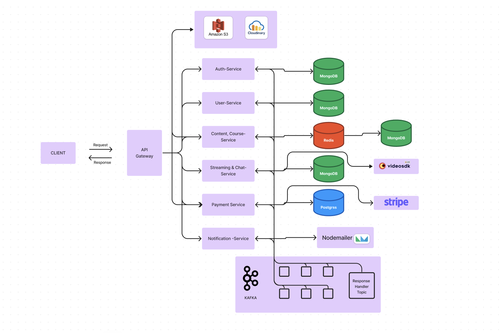

# Eduverse E-Learning Platform

Eduverse is an innovative educational networking platform where learners and instructors connect to share knowledge. Our platform empowers instructors to easily apply, create courses, conduct exams, host live sessions, and make announcements, thereby enriching the learning experience for students worldwide.

## Table of Contents
- [Features](#features)
- [Technology Stack](#technology-stack)
- [Getting Started](#getting-started)
  - [Prerequisites](#prerequisites)
  - [Installation](#installation)
- [Usage](#usage)
- [System Architecture](#system-architecture)
- [Contributing](#contributing)
- [License](#license)

## Features

- **Comprehensive Course Management**: Offer both free and paid courses with seamless payments.
- **Real-time Interaction**: Implement text-chatting, audio/video communication, and file sharing using WebSockets for engaging learning environments.
- **Microservices Architecture**: Ensure scalability and maintainability using clean architecture principles and Apache Kafka for efficient interservice communication.
- **Cloud-Native Deployment**: Utilize containerization with Docker and deploy on Azure Kubernetes Service for optimal performance and scalability.
- **Instructor Onboarding**: Streamlined process for instructors to apply and get admin approval to join the platform.

## Technology Stack

- **Frontend**: React.js, Redux, WebRTC
- **Backend**: Node.js, Express.js
- **Database**: MongoDB
- **Messaging**: Apache Kafka
- **Containerization**: Docker
- **Orchestration**: Kubernetes (Azure Kubernetes Service)
- **Streaming**: HLS (HTTP Live Streaming)

## Getting Started

### Prerequisites

- Node.js (v14 or later)
- npm (v6 or later)
- MongoDB (v4 or later)
- Docker
- Kubernetes CLI (kubectl)

### Installation

1. Clone the repository:

   ```bash
   git clone https://github.com/your-username/recurring.git
   ```

2. Navigate to the project frontend directory:

   ```bash
   cd recurring/recurring-web
   ```

   ```bash
   npm install
   ```

   ```bash
   npm run dev
   ```

3. Navigate to the project backend directory:

   ```bash
   cd recurring/recurring-backend
   ```

   ```bash
   npm install
   ```

   ```bash
   npm run dev
   ```

## Usage

1. Access the application at `http://localhost:3000` (or the port specified in your environment).
2. Register as a student or apply as an instructor.
3. Explore courses, participate in live sessions, or create content (for approved instructors).

## System Architecture



Our system utilizes a microservices architecture to ensure scalability and maintainability:

- **API Gateway**: Routes requests to appropriate microservices
- **Auth Service**: Handles user authentication and authorization
- **Course Service**: Manages course creation and delivery
- **Streaming Service**: Handles video streaming using HLS
- **Interaction Service**: Manages real-time communication features
- **Payment Service**: Processes payments for paid courses

## Contributing

We welcome contributions to Eduverse! Please see our [CONTRIBUTING.md](CONTRIBUTING.md) for details on our code of conduct and the process for submitting pull requests.

## License

This project is licensed under the MIT License - see the [LICENSE.md](LICENSE.md) file for details.


### End of Page
